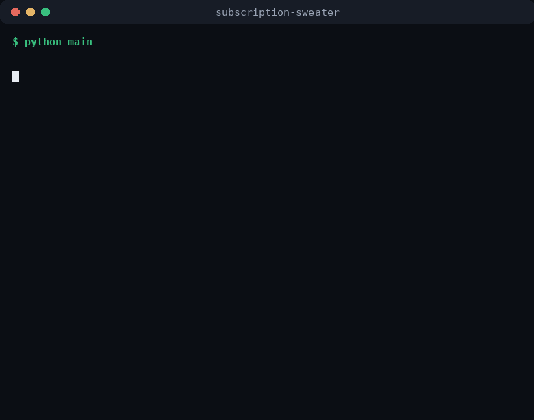

<div align="center">


# 🧣 Subscription Sweater

**No API keys. No extra bills. Just the subscription you already pay for.**


[](https://github.com/prashant-kotian/subscription-sweater/actions/workflows/ci.yml)
[](https://www.python.org/downloads/)
[](LICENSE)
[](https://star-history.com/#prashant-kotian/subscription-sweater&Date)

You already pay for ChatGPT / Claude / Gemini / Qwen. This tool puts that
subscription on an assembly line: hand it a file of prompts, it drives the LLM
you log into every day — **browser tab or official desktop app** — sends them
one at a time, and files every answer into a fresh **txt / Excel / Word** file.

**No API key · No cloud · No per-token bill · 100% on your machine**



</div>

---

## Why does this exist?

API tokens for frontier-class models run **$5–75 per million tokens**. A few
hundred research, grading, content or benchmark prompts adds up to real money
*on top of* the subscription you already pay.

Subscription Sweater doesn't buy tokens. It does what you do manually — open
the app, paste, wait, copy — but a thousand times over, unattended:

- **Your existing login** is the only credential. Log in once; it's remembered
  in a local profile folder.
- **100% local.** Nothing leaves your machine except the normal traffic between
  your client and the LLM service you choose. No middleware, no cloud, no
  telemetry.
- **Be a good citizen.** This drives *your own* UI at human-ish pace (2 s
  between prompts, configurable). Respect your account's ToS and usage limits —
  stop/resume is safe any time, so a limit hit is just a pause.

## Features

- **5 ways to reach the LLM**

  | Mode | What it does | Good for |
  |---|---|---|
  | **Browser automation** | Drives its own Chromium window on ChatGPT / Claude / Gemini / Qwen. Login once, remembered forever. | unattended batches |
  | **Desktop app automation** | Attaches to the **official ChatGPT / Claude desktop app** (CDP) and runs the same automation inside it. | you live in the desktop app |
  | **Terminal (CLI)** | Drives the **official subscription CLI** for the site headless — **Codex** (`codex exec`, ChatGPT), **Antigravity** (`agy -p`, Gemini — Google's successor to the retired Gemini CLI), **Claude Code** (`claude -p`), **Qwen Code** (`qwen -p`) — one call per prompt, and it's the **native MCP path for all four** (the consumer web products have no local MCP attachment at all). | unattended batches **with real MCP tools** + file-path image attach |
  | **Manual paste** | The tool pastes the prompt and copies the answer *for you*; you click two buttons per prompt (auto window-focus by title). | **any** LLM app that has no other option |
  | **Mock** | No browser, no LLM — fake answers. | test files/settings for free |

- **Pick the model** — per run *and per prompt* (`GPT-5`, `GPT-4o`, `Opus`,
  `Sonnet`, `Qwen3-Max`…): the tool clicks the site's own model picker.
- **Tool control (web search / MCP / skills)** — per run *and per prompt*:
  force ON/OFF, allow/deny specific MCP servers, attach skills, and **connect
  any MCP server** (paste its JSON — it's written into the right client
  automatically, original backed up: Claude desktop config,
  `~/.codex/config.toml` for Codex, `~/.gemini/config/mcp_config.json` for
  Antigravity CLI, `~/.claude.json` for Claude Code, `~/.qwen/` for Qwen Code —
  and each prompt is scoped to exactly the servers it's allowed to use).
- **Attach chart images automatically** — name them after the prompt ID and
  the tool clicks the paperclip for you (vision questions included). In
  **terminal mode** images are a file location: paste
  `@@image: H:\path\to\chart.png` in the prompt — Codex attaches it natively
  (`--image`), the other CLIs read the file themselves.
- **Understands benchmark sheets** — files wrapped in
  `>>> PASTE BELOW >>> … <<< PASTE ABOVE <<<` markers: only the marked sections
  are sent; IDs, "reference only" notes and headers never leave the file, and
  the ID (e.g. `GZ-01`) is kept as the answer's label.
- **Crash-proof** — each answer is saved *immediately*; Stop / Ctrl+C / internet
  dropout lose nothing; restart resumes exactly where it stopped.
- **Every format** — input: `.txt .csv .xlsx .docx(.doc)` · output: `.txt .xlsx .docx`
- **3 frontends** — local **web UI** (one browser tab: upload, toggles, live
  log, download), **desktop window** (Tkinter), or **CLI**.

## 60-second quickstart

```bash
# 1 · install (or run the matching install_*.script)
pip install -r requirements.txt
python -m playwright install chromium

# 2 · test the pipeline with zero accounts (fake answers)
python main.py -i sample/prompts_sample.txt --mode mock -o sample/answers.txt

# 3 · real run: 5 prompts from Excel → Word, via ChatGPT
python main.py -i prompts.xlsx -o answers.docx --site chatgpt --model "GPT-5"
```

Or open the **web UI** and click:

```bash
python main.py --web        # → http://127.0.0.1:8321 (local only)
```

Upload prompts (+ chart images) · pick mode/site/model · flip the toggles ·
**START** · watch the live log · download the answers.

## Supported targets

| Target | Browser | Desktop | Terminal (CLI) | Notes |
|---|---|---|---|---|
| **ChatGPT** | ✅ | ✅ | ✅ | browser: model picker, Web toggle, image attach · **CLI (Codex): native MCP**, native `--image` attach |
| **Claude** | ✅ | ✅ | ✅ | desktop/browser: model picker, Research toggle, MCP config merge · **CLI (Claude Code): native MCP** |
| **Gemini** | ✅ | — | ✅ | browser: model picker + image attach · **CLI: native MCP** (`agy -p`, Antigravity CLI — auto-detected, falls back to legacy `gemini`) |
| **Qwen** | ✅ | — | ✅ | browser: chat.qwen.ai · **CLI: native MCP** (`qwen -p`, `~/.qwen/settings.json`) |
| **Any other URL** | ✅ (custom URL) | — | — | generic selectors + `--debug` dumps to teach it |
| **Any app, anywhere** | ✅ (manual mode) | — | — | paste/copy on your behalf |

**Terminal mode in 3 commands** (free login, no API key):

```powershell
# 1 · install the CLI for the site you want to drive (once):
#    chatgpt → Codex CLI        npm install -g @openai/codex
#    gemini  → Antigravity (agy)  irm https://antigravity.google/cli/install.ps1 | iex
#               (Go binary, no Node.js; gemini-cli was retired for individual
#                accounts on 2026-06-18 — agy is the successor)
#    claude  → Claude Code      npm install -g @anthropic-ai/claude-code
#    qwen    → Qwen Code        npm install -g @qwen-code/qwen-code
# 2 · log in once in a terminal (codex / agy / claude / qwen → your account)
# 3 · run:
python main.py --mode terminal --site gemini  -i prompts.txt -o answers.txt   # or --site chatgpt / claude / qwen
```

Your MCP servers (pasted in the UI or `--mcp-json`) are merged into the
client's config file with a timestamped backup, then scoped **per prompt** —
a prompt with MCP off literally can't call an MCP tool (gemini/qwen:
`--allowed-mcp-server-names` allow-list · agy: the run's servers are toggled
in `mcp_config.json` before each launch, it has no allow-list flag · codex:
`-c mcp_servers.<name>.enabled=false` launch overrides · claude: a per-launch
`--mcp-config` file with `--strict-mcp-config` containing only the allowed
servers). Images are attached by **file location** — `@@image:
H:\path\to\chart.png` in the prompt (Codex: native `--image`; the other CLIs
read the file with their own file tools).

If a site redesigns a button, run once with `--debug`: screenshots + HTML land
in `debug/`, and the exact selector goes into the 20-line table at the top of
`llm_batch/browser_bot.py`.

## Model selection

Set **Model** (or `--model "GPT-4o"`): the tool opens the site's own picker and
clicks the matching entry (fuzzy, case-insensitive; cached so it won't re-open
if already active). Per prompt: put `@@model: GPT-5` inside the prompt file.
No picker found → continues with the app default and says so in the log — it
never fails a batch over this.

## Tool control: web search · MCP · skills

Three priority layers — **deny list** (hard limit) → **per-prompt `@@`
directives** → **run policy**:

```
@@websearch: on|off        force web search for this prompt
@@mcp: on|off              force MCP for this prompt
@@mcp: use: github, files  run this prompt with only these servers
@@skill: pdf               attach a skill
@@model: GPT-5             run this prompt on a specific model
@@image: GZ-15_chart.png   attach an image (by label/filename…)
@@image: H:\imgs\c.png     …or by pasted file location (terminal mode reads it from disk)
@@no: websearch, mcp:github, skill:x   per-prompt deny
```

Run policies (GUI / web page / CLI): web search **Auto** (detects "search the
web", "latest", "today's price"…) / Always / Never · MCP Never / Auto / Always ·
allowed & denied server lists · skills.

Enforced in every client: the site's own **UI toggle** (only when its state
can be read), **MCP config** (Claude desktop / Codex / Antigravity CLI /
legacy Gemini CLI / Claude Code / Qwen Code — with backup), a per-prompt
**MCP scope** in terminal mode (`--allowed-mcp-server-names` for gemini/qwen ·
`mcp_config.json` toggle for agy · `-c …enabled=false` overrides for Codex ·
strict `--mcp-config` file for Claude Code — so a prompt with MCP off can't
call any tool), and an explicit **instruction line** appended to the prompt —
so "never use web search" is honoured in *every* client, and the log prints
the resolved decision per prompt: `tools: web=off  mcp=ON(github)  model=GPT-5`.

**Local MCP, per client.** The consumer **web** products differ: ChatGPT's web
MCP connectors only accept **public HTTPS endpoints** (its local-stdio servers
need OpenAI's separate "Secure MCP Tunnel"), while Gemini/Qwen's web products
have no MCP attachment at all. **Terminal mode closes that gap for every
site** — Codex CLI (ChatGPT), Antigravity CLI (Gemini), Claude Code (Claude)
and Qwen Code all speak local stdio MCP natively, so a purely-local MCP server
runs on **Claude desktop mode** or **any terminal mode**.

## Reliability details

- Answer finished = **text stopped changing** (6 s stable, configurable) —
  not a blind timer, so streaming works on all sites; 5-min hard cap saves
  whatever was written.
- Failed prompts are saved as `(FAILED)` rows, never silently skipped.
- Every prompt → immediate save → autosaved file; resume counts what's there.
- Log-in detection: the tool waits (5 min, configurable) for you to log in,
  then proceeds; it never touches credentials itself.

## Privacy & safety

- Binds to `127.0.0.1` (web UI) — only you can reach it. `--host 0.0.0.0`
  exposes it to your LAN if you want.
- `browser_profile/`, `settings.json`, `debug/`, uploads & outputs are
  git-ignored by default.
- It types into a real UI at human pace; if your provider shows a
  rate-limit/verification screen, the run pauses on that prompt — handle it,
  and resume.

## Troubleshooting

| Symptom | Fix |
|---|---|
| `Login required` loop | delete `browser_profile/`, log in again |
| `(model picker not found…)` | check the exact model name in the picker; it's a warning, not a stop |
| input box / send button not found | add `--debug`, put the new selector into `SITES` in `browser_bot.py` |
| Chromium won't launch | `python -m playwright install --with-deps chromium` |
| desktop app ignores the debug flag | Microsoft Store builds may ignore CLI args — use the direct-download installer, or use browser mode |
| image not attached | log says so; retry that prompt (`--start N --limit 1`) or use manual mode for it |

## Development

```bash
python selftest.py     # offline: policy engine, marked-block parser, readers,
                       # writers, image attach, resume — no network, no accounts
```

## If this saves you money

…a ⭐ makes the assembly line spin faster. PRs, issues and new-site selectors
are very welcome.

<div align="center">

[](https://star-history.com/#prashant-kotian/subscription-sweater&Date)

Built with 🧶 by people who already pay for their AI.
<br><sub>Questions, new sites, new fronts: [open an issue](https://github.com/prashant-kotian/subscription-sweater/issues) — they're the fastest way to get a feature.</sub>

[↑ back to top](#-)

</div>

## License

[MIT](LICENSE)
